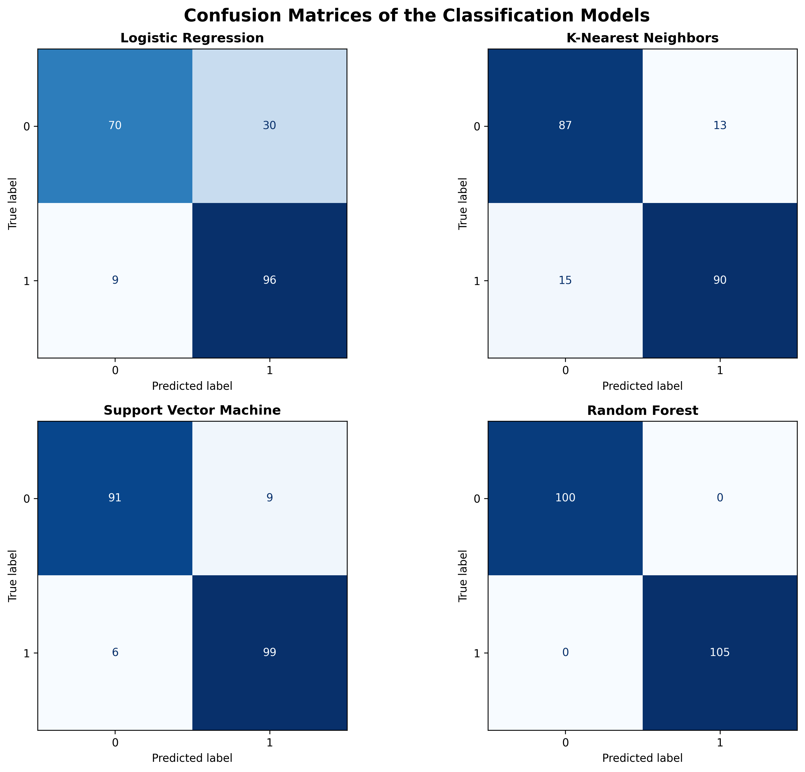
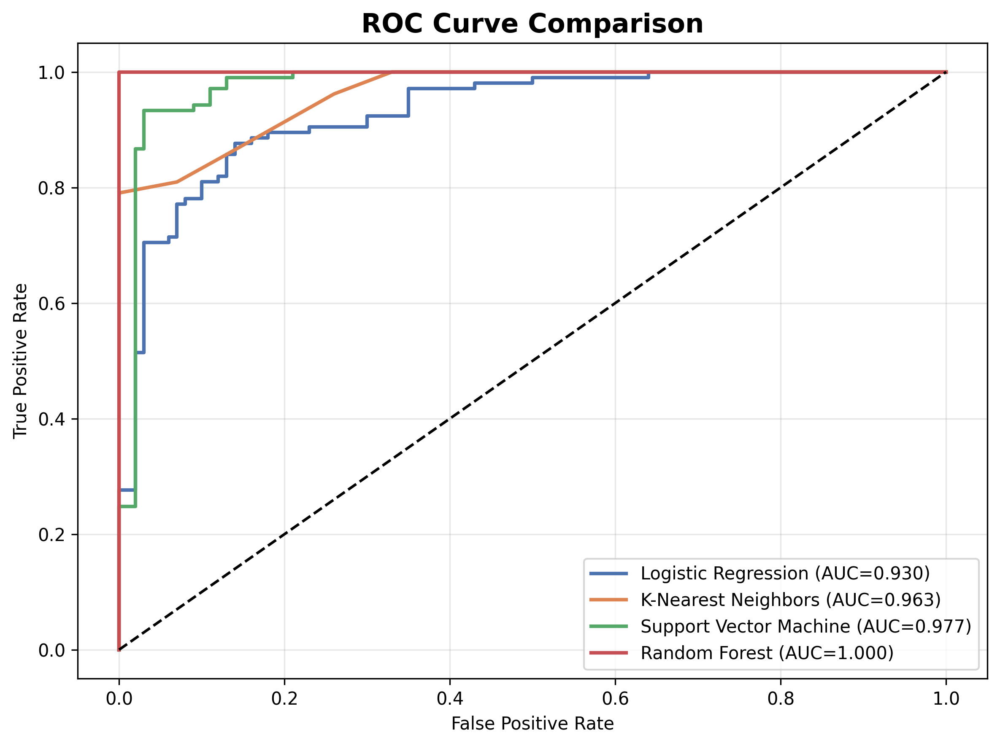
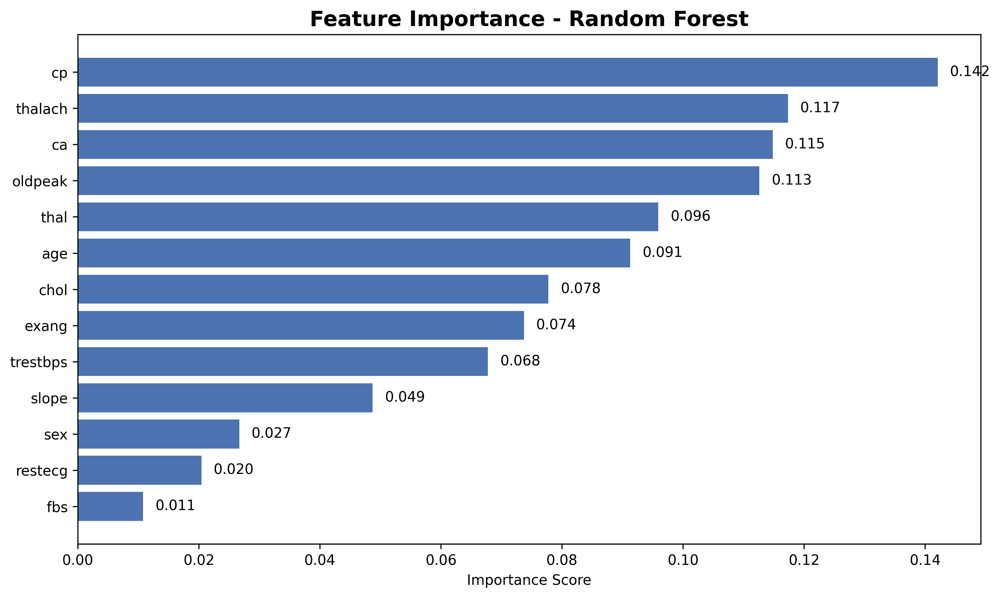

# Heart Disease Prediction Using Machine Learning

## Project Overview

This project presents a comparative analysis of machine learning classification models for heart disease prediction.

The implementation is based on the IEEE conference paper:

**Comparative Analysis of Classification Models for Heart Disease Prediction Using Machine Learning**

The project reproduces the main experimental workflow described in the paper and extends it using hyperparameter tuning, cross-validation, and feature importance analysis.

---

## Project Objectives

The main objectives of this project are:

- To preprocess and analyze a clinical heart disease dataset.
- To train and compare multiple supervised classification models.
- To evaluate model performance using several classification metrics.
- To identify the model with the highest predictive performance.
- To extend the original paper using GridSearchCV and 5-Fold Cross Validation.

---

## Dataset

The project uses the Heart Disease Dataset referenced in the selected paper.

Dataset characteristics:

- 1,025 patient records
- 13 clinical input features
- One binary target variable
- `0` — absence of heart disease
- `1` — presence of heart disease

The clinical features include:

- Age
- Sex
- Chest pain type
- Resting blood pressure
- Cholesterol
- Fasting blood sugar
- Resting ECG results
- Maximum heart rate
- Exercise-induced angina
- ST depression
- ST slope
- Number of major vessels
- Thalassemia type

---

## Machine Learning Models

The following classification models were evaluated:

1. Logistic Regression
2. K-Nearest Neighbors
3. Support Vector Machine
4. Random Forest

Feature scaling was applied to Logistic Regression, KNN, and SVM using `StandardScaler`.

Random Forest was trained using the original, unscaled feature values.

---

## Evaluation Metrics

The models were evaluated using:

- Accuracy
- Precision
- Recall
- F1-Score
- ROC-AUC
- Confusion Matrix

---

## Baseline Results

| Model | Accuracy | Precision | Recall | F1-Score | ROC-AUC |
|---|---:|---:|---:|---:|---:|
| Random Forest | 1.0000 | 1.0000 | 1.0000 | 1.0000 | 1.0000 |
| Support Vector Machine | 0.9268 | 0.9167 | 0.9429 | 0.9296 | 0.9771 |
| K-Nearest Neighbors | 0.8634 | 0.8738 | 0.8571 | 0.8654 | 0.9630 |
| Logistic Regression | 0.8098 | 0.7619 | 0.9143 | 0.8312 | 0.9298 |

Random Forest achieved the highest performance, followed by SVM, KNN, and Logistic Regression.

The ranking of the models is consistent with the conclusion presented in the selected research paper.

---

## Confusion Matrices

The confusion matrices show the number of correct and incorrect classifications produced by each model.



Random Forest correctly classified all test observations in the selected train-test split.

---

## ROC Curve Analysis

The ROC curve compares the ability of the models to distinguish between patients with and without heart disease.



Random Forest achieved an ROC-AUC score of `1.000`, followed by SVM with an ROC-AUC score of approximately `0.977`.

---

## Feature Importance

Random Forest was also used to estimate the relative contribution of each clinical feature.



The most influential features were:

- Chest pain type (`cp`)
- Maximum heart rate (`thalach`)
- Number of major vessels (`ca`)
- ST depression (`oldpeak`)
- Thalassemia type (`thal`)

Feature importance values indicate contribution to the Random Forest prediction process and should not be interpreted as direct medical causation.

---

## Project Extension

The original paper was extended using the following techniques:

### Hyperparameter Tuning

`GridSearchCV` was used to find the best Random Forest hyperparameters.

The selected parameters were:

| Hyperparameter | Optimal Value |
|---|---:|
| `n_estimators` | 200 |
| `max_depth` | 10 |
| `min_samples_split` | 2 |
| `min_samples_leaf` | 1 |

The best GridSearchCV cross-validation accuracy was:

**98.54%**

### 5-Fold Cross Validation

Cross-validation was used to evaluate model stability across multiple data splits.

| Model | Mean Accuracy | Standard Deviation |
|---|---:|---:|
| Logistic Regression | 0.8459 | 0.0279 |
| KNN | 0.8332 | 0.0181 |
| SVM | 0.9210 | 0.0334 |
| Random Forest | 0.9971 | 0.0059 |

Random Forest achieved both the highest mean accuracy and the lowest standard deviation, indicating strong and consistent performance across the five folds.

---

## Important Dataset Note

The dataset contains repeated observations.

These records were retained in the baseline experiment in order to preserve the dataset structure referenced in the selected paper.

Because repeated observations may appear in different training and testing subsets, the very high Random Forest performance should be interpreted carefully.

Cross-validation was therefore added to provide a more robust evaluation of model stability.

---

## Repository Structure

```text
Heart-Disease-Prediction-ML/
│
├── data/
│   └── heart.csv
│
├── docs/
│   └── presentation.pdf
│
├── models/
│   └── best_random_forest_model.pkl
│
├── notebooks/
│   └── Heart_Disease_Project.ipynb
│
├── outputs/
│   ├── confusion_matrices.png
│   ├── roc_curve.png
│   ├── feature_importance.png
│   ├── model_performance.csv
│   └── cross_validation_results.csv
│
├── .gitignore
├── README.md
└── requirements.txt
